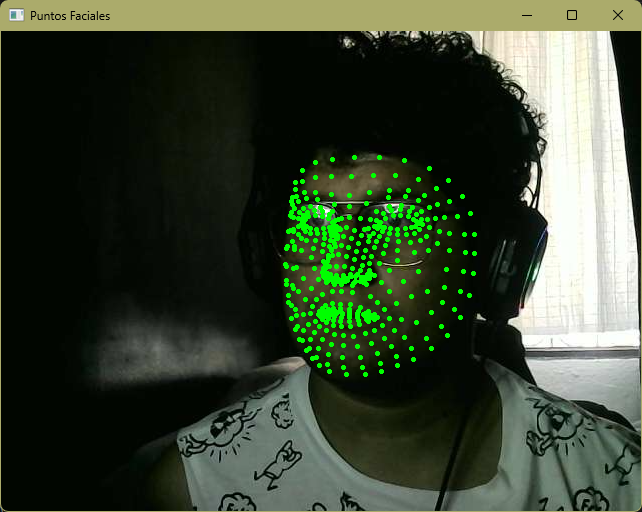

# Proyecto Identificación de Personas y Reconocimiento de Gestos Faciales con MediaPipe

 ***Melvin Marin Gonzalez 21120229***

## Avance 1: Creación del Cascarón del Proyecto

En este primer avance, se configuró el entorno de trabajo y se implementó una estructura básica para la detección de rostros y puntos faciales utilizando la librería MediaPipe. La aplicación captura video desde la cámara web y muestra los puntos faciales de una persona en tiempo real.

1. **Instalación y configuración de las librerías necesarias**:
   - Se utilizaron las librerías `mediapipe` para la detección de rostros y puntos faciales y `opencv` para la captura de video y visualización de los resultados.

2. **Configuración de MediaPipe**:
   - Se configuró MediaPipe para la detección de rostros y la captura de puntos faciales en tiempo real. MediaPipe permite identificar diferentes puntos clave en el rostro que se utilizan para detectar expresiones faciales.

3. **Captura de video en tiempo real**:
   - Usando OpenCV, se configuró la cámara para capturar imágenes en vivo y procesarlas en tiempo real.

4. **Dibujo de puntos faciales**:
   - Se crearon funciones que dibujan puntos verdes en las áreas específicas del rostro, como los ojos, la boca y las cejas, usando los datos proporcionados por MediaPipe.

### ¿Cómo se hizo?

- **Uso de MediaPipe**: Se utilizó la clase `FaceMesh` de MediaPipe para obtener los puntos faciales. Esta clase nos proporciona una lista de 468 puntos en el rostro, que corresponden a características como los ojos, la boca, la nariz y las cejas.
  
- **Captura de video**: Usamos OpenCV para abrir la cámara web y capturar los fotogramas en tiempo real. Los fotogramas luego son procesados para detectar los puntos faciales.

- **Mostrar los puntos faciales**: Cada vez que se detectan los puntos faciales, estos se dibujan en el fotograma en tiempo real. Los puntos son dibujados como círculos pequeños sobre el rostro, sin modificar el fondo de la imagen.

### Resultados obtenidos

- El sistema ahora es capaz de mostrar los puntos faciales sobre la imagen capturada en tiempo real.
- Se puede ver el rostro de la persona con los puntos representados como círculos verdes sobre las diferentes partes del rostro.
  
  ### Ejemplo de Resultado
  