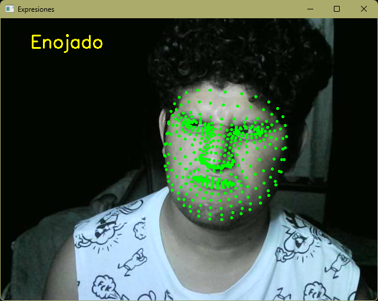
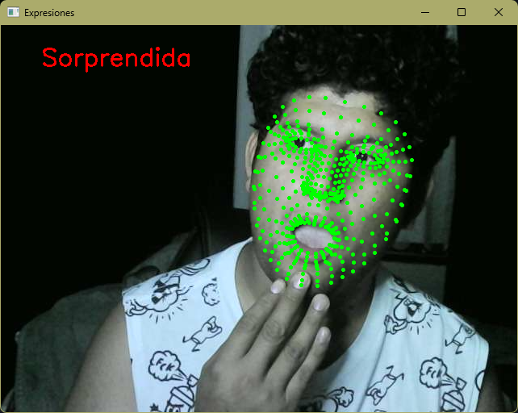
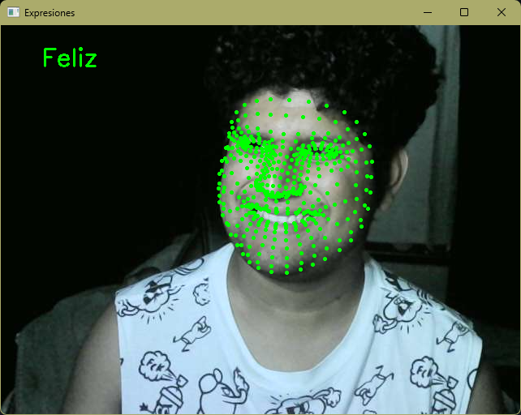
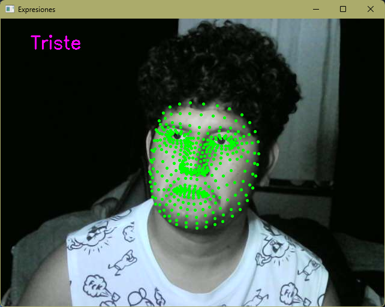
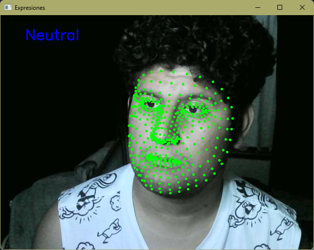

# Proyecto Identificación de Personas y Reconocimiento de Gestos Faciales con MediaPipe

 ***Melvin Marin Gonzalez 21120229***

## Avance 1: Creación del Cascarón del Proyecto

En este primer avance, se configuró el entorno de trabajo y se implementó una estructura básica para la detección de rostros y puntos faciales utilizando la librería MediaPipe. La aplicación captura video desde la cámara web y muestra los puntos faciales de una persona en tiempo real.

1. **Instalación y configuración de las librerías necesarias**:
   - Se utilizaron las librerías `mediapipe` para la detección de rostros y puntos faciales y `opencv` para la captura de video y visualización de los resultados.

2. **Configuración de MediaPipe**:
   - Se configuró MediaPipe para la detección de rostros y la captura de puntos faciales en tiempo real. MediaPipe permite identificar diferentes puntos clave en el rostro que se utilizan para detectar expresiones faciales.

3. **Captura de video en tiempo real**:
   - Usando OpenCV, se configuró la cámara para capturar imágenes en vivo y procesarlas en tiempo real.

4. **Dibujo de puntos faciales**:
   - Se crearon funciones que dibujan puntos verdes en las áreas específicas del rostro, como los ojos, la boca y las cejas, usando los datos proporcionados por MediaPipe.

### ¿Cómo se hizo?

- **Uso de MediaPipe**: Se utilizó la clase `FaceMesh` de MediaPipe para obtener los puntos faciales. Esta clase nos proporciona una lista de 468 puntos en el rostro, que corresponden a características como los ojos, la boca, la nariz y las cejas.
  
- **Captura de video**: Usamos OpenCV para abrir la cámara web y capturar los fotogramas en tiempo real. Los fotogramas luego son procesados para detectar los puntos faciales.

- **Mostrar los puntos faciales**: Cada vez que se detectan los puntos faciales, estos se dibujan en el fotograma en tiempo real. Los puntos son dibujados como círculos pequeños sobre el rostro, sin modificar el fondo de la imagen.

### Resultados obtenidos

- El sistema ahora es capaz de mostrar los puntos faciales sobre la imagen capturada en tiempo real.
- Se puede ver el rostro de la persona con los puntos representados como círculos verdes sobre las diferentes partes del rostro.
  
  ### Ejemplo de Resultado
  

# Avance 2: Expresiones  
Este avance se centra en la detección de diversas expresiones faciales utilizando MediaPipe y OpenCV. Se detectan y clasifican las siguientes expresiones:

- Enojado
- Triste
- Sorprendida
- Feliz
- Neutral

El código utiliza distintos puntos de referencia de la malla facial (por ejemplo, índices para la boca, cejas y ojos) para calcular relaciones o diferencias que se correlacionan con ciertas expresiones. Además, se imprime en consola ciertos valores (como distancias y ratios) cada 1 segundo para poder reajustar los umbrales y mejorar la precisión de la detección.

## Puntos de Referencia y Cálculos
### Boca:
Se utilizan puntos específicos (como las comisuras, el borde superior y el inferior de la boca) para medir el ancho y la altura de la boca. La relación entre el ancho y la altura (ancho/alto) varía según la expresión:

Una relación baja indica que la boca está abierta (característico de la expresión de sorpresa).

Una relación en un rango alto (por ejemplo, entre 5 y 10) sugiere una sonrisa, lo que se interpreta como felicidad.

### Cejas y Ojos:
Para detectar la expresión de enojo se evalúa la distancia entre las cejas en relación con la distancia entre los ojos (o puntos representativos de los ojos). En una persona enojada, las cejas tienden a acercarse. Se calcula un ratio (distancia entre cejas / distancia entre ojos), y un valor bajo de este ratio se interpreta como enojo.

## Impresión de Valores para Reajuste de Umbrales
Para afinar y depurar el sistema, se imprime en la consola, cada 1 segundo, información clave:

### Para la boca (felicidad o sorpresa):
Se imprimen el ancho, la altura y la relación (ratio) de la boca. Estos valores permiten ajustar el umbral que determina si la boca está en una posición típica de sorpresa (relación baja) o de felicidad (relación dentro de un rango específico).

### Para las cejas y ojos (enojo):
Se imprime la distancia entre las cejas, la distancia entre los ojos (o puntos representativos), y el ratio resultante. Esto ayuda a reajustar el umbral que indica si las cejas están demasiado juntas, lo cual es indicativo de enojo.

### Para la tristeza:
Se imprimen las diferencias normalizadas entre las esquinas de la boca y el centro vertical, así como la suma de estas diferencias. Esto facilita la evaluación de cuándo las esquinas de la boca están lo suficientemente caídas como para considerarse una expresión de tristeza.

## Clasificación de Expresiones
El sistema evalúa las expresiones en el siguiente orden de prioridad:

- Enojado:
Se detecta si las cejas se han acercado significativamente en relación con la distancia entre los ojos.

- Sorprendida:
Se determina a partir de la relación baja entre el ancho y la altura de la boca, indicando que la boca está abierta.

- Feliz:
Se clasifica cuando la relación de la boca se encuentra dentro de un rango específico (por ejemplo, entre 5 y 10).

- Triste:
Se detecta mediante la evaluación de la caída de las esquinas de la boca respecto al centro vertical.

- Neutral:
Si ninguna de las condiciones anteriores se cumple, la expresión se clasifica como neutral.

