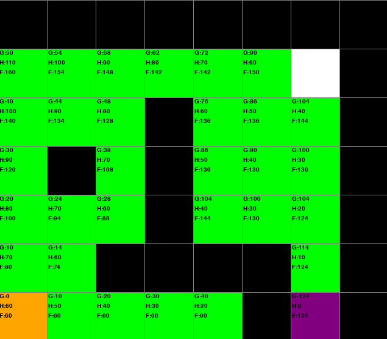
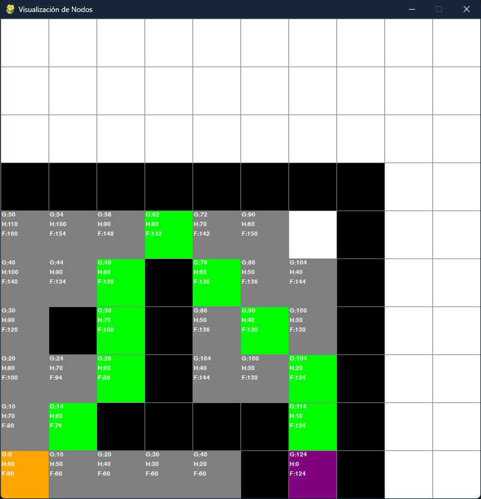

# **Proyecto A***

**Alumo**: Melvin Marin Gonzalez 21120229


# Avance 1: Búsqueda de todos los vecinos posibles 16/03/2025

En este avance se implementa la **búsqueda de todos los vecinos** en la cuadrícula, es decir, se exploran todos los nodos posibles.  Además, se pintan de color **Gris** los nodos actualizados y se muestran en pantalla los valores de `g`, `h` y `f` tanto en la ventana gráfica como en la terminal. También se agregó la funcionalidad de que la exploración comience al presionar la tecla **Espacio**.

## Descripción General

1. **Nodos con Costos**
    
    - Se han añadido atributos en la clase `Nodo` para manejar los costos asociados al algoritmo A*. Estos son:
      
      ```python
      self.g = float("inf")  # Costo acumulado desde el nodo inicial. "inf" representa un valor infinito, lo que indica que inicialmente no se conoce un camino hacia el nodo.
      self.h = 0             # Heurística (estimación de la distancia al nodo final).
      self.f = float("inf")  # Costo total estimado (f = g + h). Inicialmente es infinito hasta que se actualiza.
      ```
      
    - Inicialmente, cada nodo tiene `g = inf` y `f = inf`, lo que significa que aún no se ha asignado un camino con un costo real. El valor `inf` (infinito) se utiliza como marcador para indicar que el costo es tan alto que, por el momento, se considera inalcanzable.

2. **Búsqueda de Todos los Vecinos**
En esta función se exploran todos los nodos o vecinos existentes en la cuadrícula. Para cada nodo actual, se obtienen sus vecinos en todas las direcciones (horizontales, verticales y diagonales). Si se detecta que un vecino tiene un costo (calculado como el costo acumulado más el costo del movimiento) menor que el valor actual almacenado en ese vecino, se actualizan sus valores de `g`, `h` y `f` y se agrega a la lista de nodos pendientes de explorar. De esta forma, se ajustan los datos de cada vecino según la ruta más barata encontrada hasta ese momento.
    
3. **Visualización de Costos**

    - **En la ventana de Pygame:**  
      Cada nodo que ha sido actualizado (es decir, cuyo valor de `g` es menor que `inf`) se pinta de **verde** y se muestra el siguiente texto en la esquina superior izquierda de la celda:
      
      ```
      G: <valor_de_g>
      H: <valor_de_h>
      F: <valor_de_f>
      ```
      
    - **En la terminal:**  
      Cada vez que se visita un nodo, se imprime un mensaje con sus coordenadas y los cálculos correspondientes:
      
      ```
      Visitado: (fila, columna) :: Calculos(G=<g>, H=<h>, F=<f>)
      ```


4. **Explicación de la Heurística (Distancia Manhattan)**

La heurística `h` se calcula usando la **distancia Manhattan** multiplicada por 10 unidades:
La distancia Manhattan se obtiene sumando las diferencias absolutas entre las coordenadas (filas y columnas) del nodo actual y el nodo final.

```python
# Heurística: usamos la distancia Manhattan multiplicada por 10 unidades
nodo_inicio.h = (abs(fila_inicio - fila_fin) + abs(col_inicio - col_fin)) * 10
nodo_inicio.f = nodo_inicio.g + nodo_inicio.h


5. **Inicio de la Exploración con la Tecla Espacio**

    - Se agregó la funcionalidad para que la exploración comience únicamente cuando el usuario presione la tecla **Espacio**.  
    - Esto permite al usuario definir previamente el nodo de inicio, el nodo final y las paredes, asegurando que la búsqueda se inicie solo cuando se hayan configurado todos los elementos necesarios.


## Ejemplo de Resultado


En la captura se observa cómo los nodos transitables (excluyendo las paredes, el nodo de inicio y el nodo final) aparecen en **verde** y muestran sus costos actualizados. Además, en la consola se reporta cada nodo visitado junto con los valores de `g`, `h` y `f`.

# Avance 2: Ruta Óptima 16/03/2025

En este avance se ha implementado la funcionalidad para **reconstruir y visualizar el camino óptimo** (o ruta más corta) desde el nodo de inicio hasta el nodo final, una vez que se han explorado todos los vecinos posibles.

## Descripción General

1. **Cambio en la Visualización de Nodos Visitados**
   - En el avance anterior, los nodos visitados se mostraban en **verde**. Ahora, para diferenciar entre la exploración y la ruta óptima, los **nodos explorados se pintan de gris**, indicando que fueron evaluados por el algoritmo pero no necesariamente forman parte del camino más corto.
   - Esto permite distinguir visualmente qué nodos fueron considerados por el algoritmo y cuáles realmente componen el camino más eficiente.

2. **Reconstrucción del Camino Óptimo**
   - Durante la exploración con A*, cada nodo actualizado almacena en su atributo `parent` una referencia al nodo desde el cual se llegó a él con el menor costo.
   - Una vez finalizada la exploración, se utiliza la función `reconstruir_camino(nodo_fin)` para seguir la cadena de predecesores desde el nodo final hasta el nodo de inicio.
   - La lista resultante se invierte para obtener el orden correcto del camino, desde el inicio hasta el final.

3. **Pintado del Camino Óptimo**
   - La función `pintar_camino(camino)` recorre la lista del camino óptimo y marca cada nodo (excepto el de inicio y fin) como parte de la ruta óptima.
   - Para ello, se activa una bandera o se modifica el color de esos nodos para que se pinten de **verde**. Este color verde resalta el camino más corto (o de menor costo) encontrado por el algoritmo A*.

4. **Visualización**
   - **Antes de pintar el camino óptimo:**  
     Los nodos visitados se muestran en **gris**, indicando que han sido evaluados durante la exploración.
   - **Después de pintar el camino óptimo:**  
     La ruta óptima se destaca en **verde** sobre la cuadrícula, permitiendo visualizar claramente la secuencia de nodos que conforman la ruta más eficiente desde el nodo de inicio hasta el nodo final.

---

## Funcionamiento del Proceso

### 1. **Exploración con el Algoritmo A\***
   - El algoritmo **A\*** comienza explorando todos los vecinos posibles, evaluando su costo `g` (costo acumulado), su heurística `h` (distancia estimada al final), y su costo total `f = g + h`.
   - Durante este proceso, **se registra el predecesor (`parent`) en cada nodo**, lo que permite luego reconstruir el camino óptimo.

### 2. **Reconstrucción de la Ruta**
   - Al finalizar la exploración, se utiliza el nodo final para **reconstruir el camino más corto** mediante una función que retrocede usando el atributo `parent`.
   - Esto genera una lista ordenada que representa la secuencia de nodos desde el inicio hasta el final.

   

` def reconstruir_camino(nodo_fin):
           """Reconstruye la ruta óptima a partir del nodo final, siguiendo los nodos parent."""
           camino = []
           nodo_actual = nodo_fin
           while nodo_actual is not None:
               camino.append(nodo_actual)
               nodo_actual = nodo_actual.parent
           camino.reverse()  # Para que el camino vaya del inicio al final
           return camino`      
       
### 3. **Pintado del Camino Óptimo**
Luego de reconstruir la ruta, se marca visualmente en la cuadrícula, pintando de verde los nodos que forman parte del camino más corto.

`
def pintar_camino(camino):
    """Pinta de verde la ruta óptima."""
    for nodo in camino:
        if not nodo.es_inicio() and not nodo.es_fin():
            nodo.hacer_camino_optimo()
`
## Explicación del Cálculo del Camino Más Corto
 ### **Atributo parent en cada nodo**

Cada nodo almacena su nodo anterior (parent), que representa la mejor forma de llegar a él desde el inicio.
Esto permite reconstruir el camino en orden inverso desde el final hasta el inicio.
Cálculo del Costo Total f = g + h

g: Representa el costo acumulado desde el inicio hasta el nodo actual.
h: Representa la estimación de la distancia restante al nodo final.
f = g + h: Se usa para decidir qué nodos explorar primero, favoreciendo aquellos con el menor costo total estimado.

### **Diferencia entre Exploración y Ruta Óptima**

Exploración (nodos en gris): Representa todos los nodos visitados por el algoritmo, no necesariamente pertenecientes al camino más corto.
Ruta Óptima (nodos en verde): Representa el conjunto de nodos que conforman la mejor ruta encontrada.

### Ejemplo de Resultado


En la imagen se puede observar cómo el algoritmo primero explora todos los nodos posibles (mostrados en gris) y luego resalta el camino más corto en verde, permitiendo una visualización clara del resultado del algoritmo A*.

